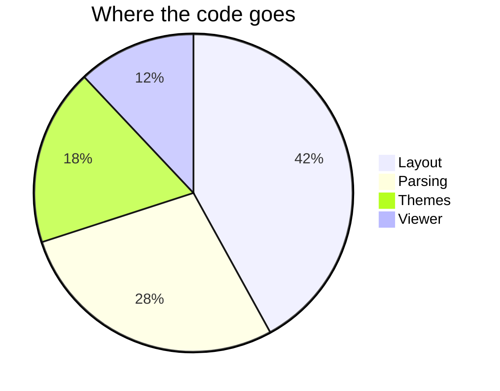
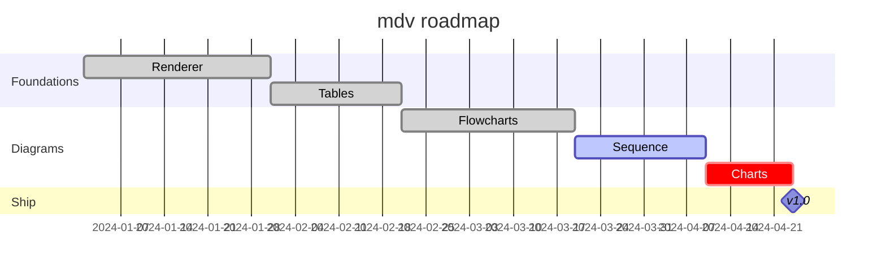

# Charts

## Pie

```mermaid
pie title Where the code goes
  "Layout" : 42
  "Parsing" : 28
  "Themes" : 18
  "Viewer" : 12
```

## Gantt

```mermaid
gantt
  title mdv roadmap
  dateFormat YYYY-MM-DD
  section Foundations
    Renderer      :done,   r1, 2024-01-01, 30d
    Tables        :done,   t1, after r1, 21d
  section Diagrams
    Flowcharts    :done,   f1, after t1, 28d
    Sequence      :active, s1, after f1, 21d
    Charts        :crit,   c1, after s1, 14d
  section Ship
    v1.0          :milestone, m1, after c1, 0d
```
