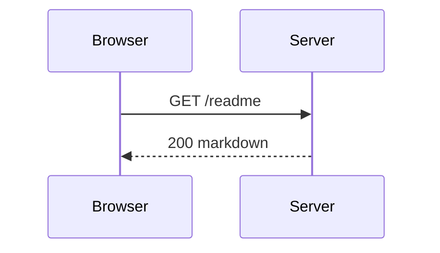
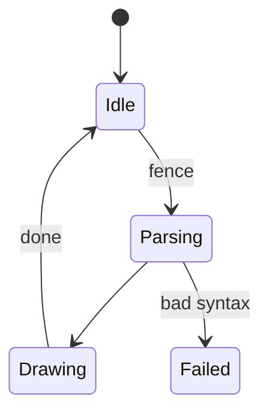

# Sequence and state

## Sequence

```mermaid
sequenceDiagram
  participant A as Browser
  participant B as Server
  A->>B: GET /readme
  B-->>A: 200 markdown
```

## State

```mermaid
stateDiagram-v2
  [*] --> Idle
  Idle --> Parsing : fence
  Parsing --> Drawing
  Drawing --> Idle : done
  Parsing --> Failed : bad syntax
```
