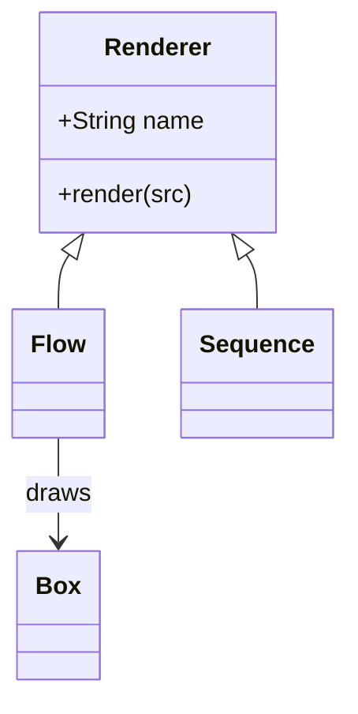
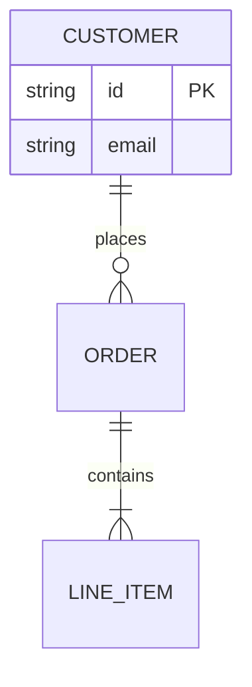

# Class and entity diagrams

## Class

```mermaid
classDiagram
  class Renderer {
    +String name
    +render(src)
  }
  Renderer <|-- Flow
  Renderer <|-- Sequence
  Flow --> Box : draws
```

## Entities

```mermaid
erDiagram
  CUSTOMER ||--o{ ORDER : places
  ORDER ||--|{ LINE_ITEM : contains
  CUSTOMER {
    string id PK
    string email
  }
```
