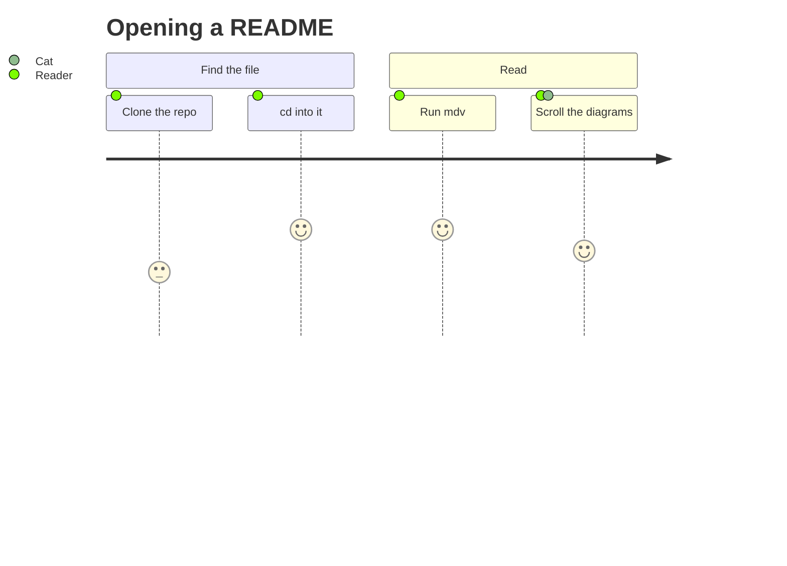
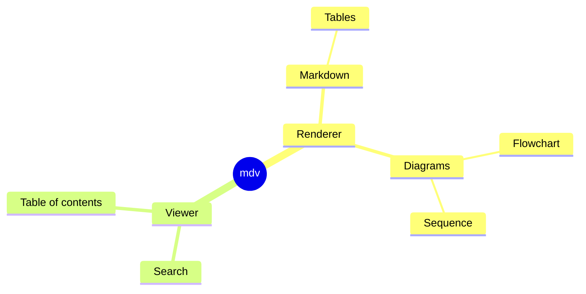

# Journeys and mindmaps

## User journey

```mermaid
journey
  title Opening a README
  section Find the file
    Clone the repo: 3: Reader
    cd into it: 5: Reader
  section Read
    Run mdv: 5: Reader
    Scroll the diagrams: 4: Reader, Cat
```

## Mindmap

```mermaid
mindmap
  root((mdv))
    Renderer
      Markdown
        Tables
      Diagrams
        Flowchart
        Sequence
    Viewer
      Search
      Table of contents
```
