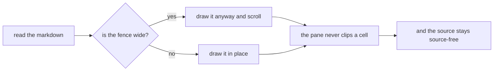

# Wide diagrams

A diagram that does not fit the pane is kept, not replaced by its source: `H`
and `L` scroll it sideways, `0` goes back.

```mermaid
graph LR
  A[read the markdown] --> B{is the fence wide?}
  B -->|yes| C[draw it anyway and scroll]
  B -->|no| D[draw it in place]
  C --> E[the pane never clips a cell]
  D --> E
  E --> F[and the source stays source-free]
```
